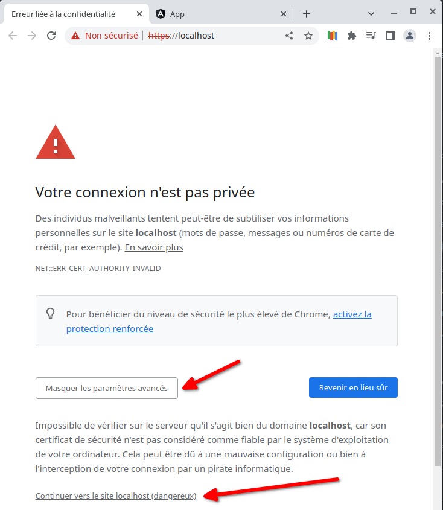
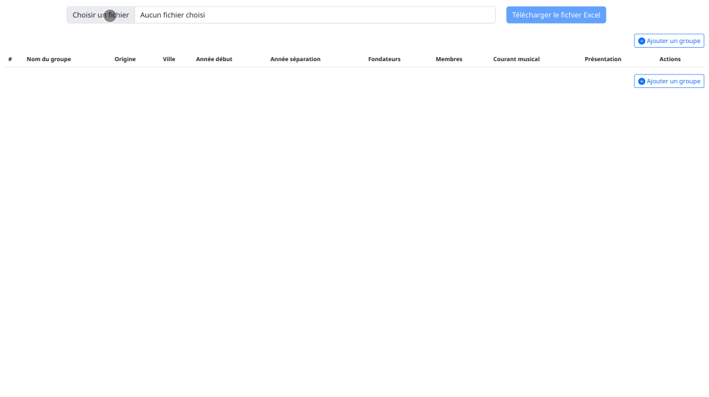
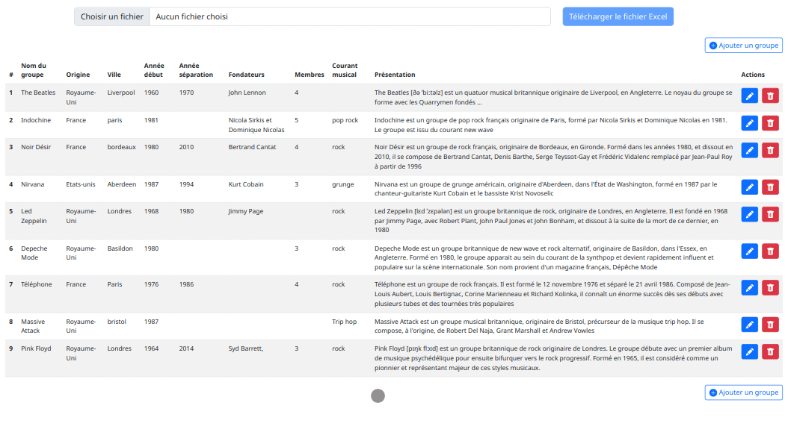
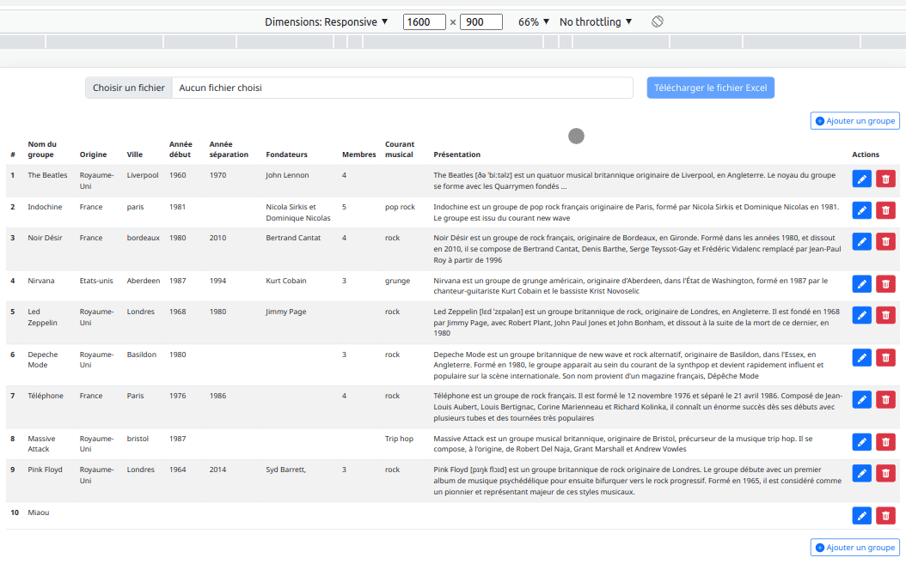
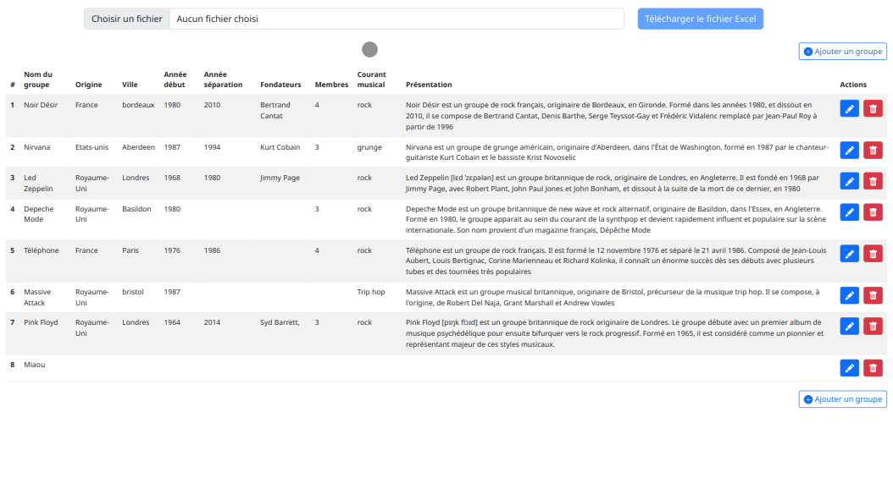
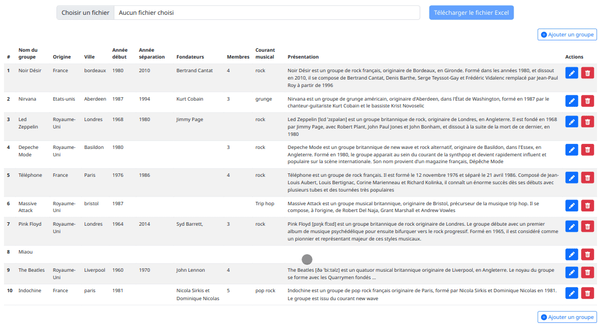
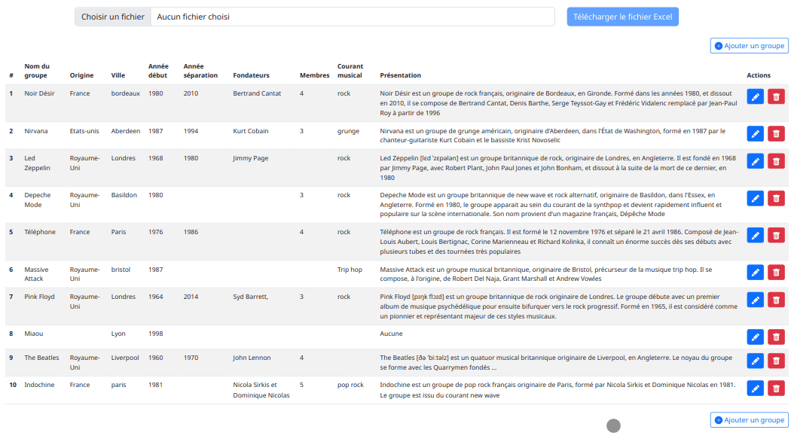
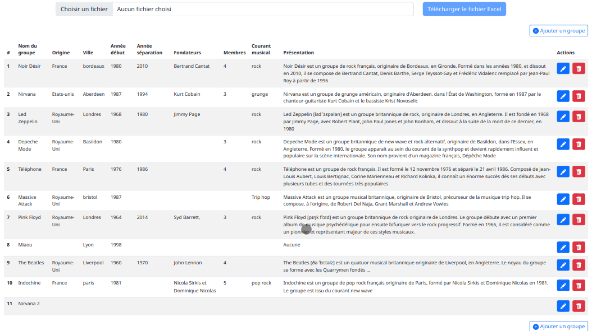

:toc: macro
:toc-title: Sommaire
:toclevels: 3
:numbered:

ifndef::env-github[:icons: font]
ifdef::env-github[]
:status:
:outfilesuffix: .adoc
:caution-caption: :fire:
:important-caption: :exclamation:
:note-caption: :paperclip:
:tip-caption: :bulb:
:warning-caption: :warning:
endif::[]

:back_to_top_target: top-target
:back_to_top_label: ⬆ Retour au sommaire
:back_to_top: <<{back_to_top_target},{back_to_top_label}>>

:main_title: Test technique
:git_project: test-symfony-angular-excel
:git_username: jprivet-dev
:git_url: https://github.com/{git_username}/{git_project}
:git_clone_ssh: git@github.com:{git_username}/{git_project}.git

[#{back_to_top_target}]
= {main_title}

toc::[]

== Instructions données

=== Objectif du test

Réaliser un système d’import de fichier Excel, avec une interface de gestion des données.
Le fichier Excel contient une liste de groupes de musique.

Le test ne doit pas excéder 7 heures (avec mise en place de la stack).

{back_to_top}

=== Contexte

En tant qu’utilisateur, je souhaite pouvoir :

* Importer le fichier Excel dans une base de données.
* Consulter, modifier ou supprimer les informations depuis une interface graphique.

{back_to_top}

=== Stack technique

* Backoffice : doit être réalisé avec Symfony (pas d'API Platform).
* Frontend : doit être réalisé avec Angular.

{back_to_top}

=== Livraison attendue

* Fournir une archive avec le code source et un dump de la BDD.
* Le code doit être accessible sur un repository en ligne (github par exemple).

== Installation complète

=== Clonage du projet

```
$ git clone git@github.com:jprivet-dev/test-symfony-angular-excel.git
$ cd test-symfony-angular-excel
```

=== L'API (Symfony)

. À partir du dossier `test-symfony-angular-excel` : `$ cd api`
. Créer (juste la première fois) l'image docker `$ make build`
. Démarrer le projet `$ make start`
. Aller sur https://localhost

Pour éviter une erreur du type `GET https://localhost/api/music-groups/data net::ERR_CERT_AUTHORITY_INVALID` qui bloquera la récupération des données, autorisez l'accès dans Chrome à l'API, en allant sur https://localhost, et en cliquant sur le bouton *Continuer vers le site localhost (dangereux)* :



=== La SPA (Angular)

. À partir du dossier `test-symfony-angular-excel` : `$ cd spa`
. `$ make start`
. Aller sur http://localhost:4200

{back_to_top}

=== Récupérer les requêtes Insomnia

Retrouver les requêtes Insomnia pour tester l'API sur https://github.com/jprivet-dev/test-symfony-angular-excel-insomnia.

Il faut forker ce dépôt et suivre les instructions sur https://docs.insomnia.rest/insomnia/git-sync.

== Présentation générale de la fonctionnalité développée

=== Cas #1 : import du fichier Excel

Dans un premier temps, le fichier excel est téléchargé sur le serveur.
Dans un second temps, les données sont extraites du fichier et enregistrées en BDD.



{back_to_top}

=== Cas #2 : création sommaire du groupe Miaou



{back_to_top}

=== Cas #3 : suppression des deux premiers groupes de la liste



{back_to_top}

=== Cas #4 : réimport du fichier Excel

On importe uniquement les lignes du fichier Excel qui n'existent pas en BDD. On récupère ainsi les deux premiers groupes supprimés précédemment :



{back_to_top}

=== Cas #5 : modification du groupe Miaou



{back_to_top}

=== Cas #6 : création du groupe Nirvana

Retour d'un message d'erreur de l'API parce que Nirvana existe déjà en BDD :



{back_to_top}

=== Cas #7 : modification d'un groupe importé



{back_to_top}

== Plan d'action technique avant implémentation

Suite à ces instructions, voici le plan d'action technique que j'ai mis en place.
Ce plan me permet d'avoir une phase de recherche bien en amont du développement, pour ensuite implémenter le tout avec plus de fluidité.
Je n'ai sincèrement aucune idée du temps que je vais mettre à l'exécution, et je vais traiter ce test dans l'esprit d'un coding dojo :)

{back_to_top}

=== Étape #1 : mise en place de la stack complète

==== Insomnia & GitHub

* Utilisation d'Insomnia pour réaliser les tests avec l'API (https://insomnia.rest/).
* Création un repo GitHub (`test-symfony-angular-excel-insomnia`) pour enregistrer et partager les requêtes.

{back_to_top}

==== Projet monolithique (API & SPA)

Afin de facilité le partage et la relecture de ce test, je créerai sur mon compte GitHub un projet monolithique (`test-symfony-angular-excel`), qui contiendra l'API (Symfony) et la SPA (Angular).
De plus le projet sera entièrement dockerisé, pour permettre à quiconque d'installer et de tester ce projet sur son poste.

Dans le cadre d'un projet de plus grande envergure, il serait préférable de séparer l'API et la SPA dans deux dépôts différents, afin de pouvoir faire évoluer et versionner les deux projets indépendamment.

{back_to_top}

==== L'utilisation des tests automatiques

Par expérience, dès que l'on configure la stack pour les tests automatiques sur un projet fraichement initialisé,
en particulier quand il est dockerisé, on rencontre inexorablement des imprévus, des incompatibilités, qui coûtent cher en temps.
Pour le moment je ne me soucie pas de ces tests automatiques. Cela me semble overkill pour un projet aussi "petit", avec un métier étant plutôt commun et une fonctionnalité sans cas limites critiques ou complexes.

Évidemment, dans le cadre d'un projet plus important, mon approche ne serait plus viable et l'usage de tests automatiques serait indispensables.
Je garde ce point dans les bonus (voir à la fin de ce README).

{back_to_top}

==== API : Symfony 6, PHP 8 & Docker

. Création d'un projet vide avec Symfony 6 & PHP 8.
. Dockerisation du projet avec https://github.com/dunglas/symfony-docker.
. Usage des codes générés avec Symfony CLI.
. Utilisation très basique du Service Layer Pattern, avec du MVC et une extraction de la logique métier dans les services.
. Limitation au niveau 2 du modèle de maturité de Richardson (CRUD + Méthodes HTTP). Pas de niveau 3 avec une API autodécouvrable (overkill pour ce test).
. Pour ce test, pas de gestion des utilisateurs, avec authentification, pour limiter l'accès aux fonctionnalités. Ce sera en bonus, s'il me reste du temps pour cela.
. Usage de la mise en forme automatique de PHPStorm, avec le formatage par défaut de Symfony (https://www.jetbrains.com/help/phpstorm/symfony-support.html).

{back_to_top}

==== SPA : Angular 14, Bootstrap 5 & Docker

. Création d'un projet vide avec Angular 14.
. Dockerisation basique avec une solution maison.
. Usage des codes générés avec Angular CLI.
. Utilisation du pattern "Container vs Presentational Components", pour facilité la construction des composants et limiter le couplage :
* containers : niveau le plus haut d'un composant, uniquement pour les composants rattachés à une route.
* smarts : composants utilisants des services (pas de @Input, ni de @Output).
* presentationals : composants qui reçoivent des inputs et qui émettent des events, rien d'autre (pas de services, que des @Input et @Ouput).
. Usage d'un store basique, avec le pattern "Observable Data Services", pas d'usage de NgRx (overkill pour ce test).
. Angular 14 permet de faire des "standalone components", sans module. N'ayant pas encore eu l'occasion d'exploiter cette nouvelle approche, je suivrai une méthode "classique", avec création de modules.
. Usage de Bootstrap 5 et https://ng-bootstrap.github.io pour la création de l'interface.

{back_to_top}

=== Étape #2 : upload du fichier Excel sur le serveur

Si nous étions dans le cas de fichiers plus volumineux, il serait préférable de les charger sur le serveur (pas dans un fichier temporaire), et de traiter l'import des données en second temps (CRON, Messenger, Command, ...). Nous sommes ici dans un test où le fichier est extrêmement petit et plutôt facile à gérer, mais nous allons conserver ce principe de gestion en deux temps.

{back_to_top}

==== API

. Création de `MusicGroupUploadController::upload()` avec la route (`POST api/music-groups/upload`).
. Création de `MusicGroupUploadService` pour la gestion de l'upload sur le serveur.
. Création de `MusicGroupFileEntity` pour avoir un historique des uploads.
. Création de `MusicGroupFileType`.
. Définition du dossier de téléchargement (`/public/uploads` par exemple).
. Le fichier Excel sera renommer avec un timestamp.
. Tests avec Insomnia.

{back_to_top}

==== SPA

. Création de `MusicGroupModule` : il contiendra tout ce qui concernera la gestion des groupes de musique de l'application.
. Création de `MusicGroupComponent` (containers) : ce sera la page principale. Elle contiendra l'upload et l'affichage des données.
. Création de `MusicGroupUploadComponent` (smarts): ce sera le composant dédié à l'upload du fichier Excel.
. Création de `MusicGroupUploadService::upload()`.
. Création de `MusicGroupFileUploadForm` (presentationals) pour l'upload du fichier Excel.
. Gestion des messages de confirmation :
* "En cours de téléchargement...", avec une icône "loader".
* "Fichier téléchargé", avec une icône "OK".
. Gestion des messages erreurs

{back_to_top}

=== Étape #3 : enregistrement des données du fichier Excel en BDD

==== API

. Création de `MusicGroupImportService` : il gérera l'import des données en BDD avec le dernier fichier Excel téléchargé.
. Usage de `MusicGroupImportService` dans `MusicGroupController::fileUpload()` de l'import des
. Utilisation de https://github.com/PHPOffice/PhpSpreadsheet
. Création de `MusicGroupDataEntity` pour toutes les données des groupes de musique à afficher et éditer.
. Les données déjà présentes en BDD ne sont pas importées.
. Gestion de la validation des données.

{back_to_top}

==== SPA

. Tester l'import complet à partir du front, avec la gestion des messages de confirmation.
. Gestion des messages erreurs

{back_to_top}

=== Étape #4 : affichage de toutes les données

==== API

. Création de `MusicGroupDataController::read()`, avec la route (`GET api/music-groups/data`).
. Création de `MusicGroupDataService::read()`.
. Pour la `JsonResponse`, usage du serializer de Symfony pour formatter au format json le tableau récupéré du `MusicGroupDataRepository`.

{back_to_top}

==== SPA

. Création de `MusicGroupDataComponent` (smarts) pour l'affichage, sous forme de tableau, des groupes de musique.
. Création de `MusicGroupData` (model).
. Création de `MusicGroupDataService::read()`.
. Gérer les messages :
* "Pas de données" si aucunes données.
. Rafraîchissement de l'affichage après tout nouvel import.

{back_to_top}

=== Étape #5 : suppression d'une ligne de données

==== API

. Création de `MusicGroupDataController::delete()`, avec la route (`DELETE api/music-groups/data/{id}`).
. Création de `MusicGroupDataService::delete()`.

{back_to_top}

==== SPA

. Dans `MusicGroupDataComponent`, ajout d'un bouton de suppression à chaque ligne du tableau.
. Création de `MusicGroupDataService::delete()`.
. Avoir un message de confirmation avant suppression.
. Gestion des messages de confirmation et d'erreurs.
. Rafraîchissement de l'affichage après suppression.

{back_to_top}

=== Étape #6 : création d'une ligne de données dans le tableau

==== API

. Création de `MusicGroupDataController::create()`, avec la route (`POST api/music-groups/data`).
. Création de `MusicGroupDataService::create()`.
. Création de `MusicGroupDataType` pour le formulaire.
. Usage du deserializer de Symfony pour formatter le json en objet pour l'enregistrement en BDD.
. Gestion des messages de confirmation et d'erreurs (validation des données).
. Quand tout est OK, retour dans la réponse JSON des données de la dernière ligne créée.
. Tests avec Insomnia.

{back_to_top}

==== SPA

. Création d'un bouton "Ajouter".
. Création de `MusicGroupDataService::create()`.
. Création de `MusicGroupDataCreateComponent` (smarts) pour la création d'une nouvelle donnée.
. Création de `MusicGroupDataForm` (presentationals) pour le formulaire.
. Affichage du formulaire dans une popin.
. Bouton de soumission "Créer".
. Gestion des messages de confirmation et d'erreurs (blocage de la soumission si les données ne sont pas au bon format).

{back_to_top}

=== Étape #7 : modification d'une ligne de données dans le tableau

. Création de `MusicGroupDataController::update()`, avec la route (`PUT api/music-groups/data`).
. Je ne fais pas de mise à jour partielle avec `PATCH`, mais directement une mise à jour de la ligne entière avec `PUT`.
. Création de `MusicGroupDataService::update()`.
. Usage de `MusicGroupDataType` (créé précédemment) pour le formulaire.
. Gestion des messages de confirmation et d'erreurs (validation des données).
. Quand tout est OK, retour dans la réponse JSON des données de la dernière ligne créée.
. Tests avec Insomnia.

{back_to_top}

==== SPA

. Ajout d'un bouton "Modifier" à chaque ligne de données.
. Création de `MusicGroupDataService::update()`.
. Création de `MusicGroupDataUpdateComponent` (smarts) pour la modification d'une nouvelle donnée.
. Usage du `MusicGroupDataForm` (presentationals) créé précédemment.
. Affichage du formulaire dans une popin, peuplé des données de la ligne à modifier.
. Bouton de soumission "Modifier".
. Gestion des messages de confirmation et d'erreurs (blocage de la soumission si les données ne sont pas au bon format).

{back_to_top}

=== Étape #8 : BONUS

Je ne sais à quels imprévus je vais faire face et combien de temps je vais mettre pour réaliser toutes ces étapes.
Selon le temps restant, je ferais un des éléments suivants.

{back_to_top}

==== Suppressions multiples

. Permettre de sélectionner plusieurs lignes pour les supprimer en une seule fois.
. Ajouter une coche à chaque ligne du tableau.
. Ajouter une coche globale pour tout sélectionner ou désélectionner.
. Faire apparaître un bouton "Supprimer les lignes cochées" dès qu'une ligne est sélectionnées.

{back_to_top}

==== Limiter l'accès qu'aux utilisateurs authentifiés

. Mettre en place un système d'authentification côté API avec formulaire à soumettre côté SPA.
. Afficher les données qu'aux utilisateurs authentifiés.
. Limiter l'import et l'édition des données qu'aux administrateurs.

{back_to_top}

==== Utiliser des tests automatiques

. Faire évoluer les fichiers docker et les configurations pour exécuter les tests automatiques.

{back_to_top}

== Conclusion

=== Impression générale

*C'est un échec sur le timing ! Je n'ai pas du tout réalisé l'ensemble de ce projet en moins de 7 heures !*

Il m'a fallu pas moins de 2 jours (en temps cumulé), pour développer cette mouture.
Même si j'avais, à mon premier commit, un plan d'action technique précis à suivre, les implémentations ne se sont pas déroulées pas comme je l'espérais.
Et malgré le délai dépassé, je voulais tout de même aller jusqu'au bout, pour fournir une fonctionnalité complète, qu'importe le temps que cela me prendrait.

L'expérience a été pour ma part très stimulante, car c'était la première fois que je réalisais d'un seul trait, un projet complet Symfony 6 / PHP 8 / Angular 14, à partir de zéro, de façon "brut" (sans l'aide d'API Platform - on revient aux fondamentaux ^^), entièrement dockerisé, et je n'avais aucune idée de la quantité de choses que je pourrais implémenter sur ce timing. J'ai maintenant une idée précise.

Sur cette mouture, il y a des dizaines de sujets que l'on pourrait largement pousser (gestion fine des erreurs, sérialisation et passages de données entre API et SPA, exploitation avancée du pattern "store like a service", validation avancée de la structure du fichier Excel importé, testing unitaire tant côté API que SPA, ou même l'UX, ...).

À lui seul, ce test pourrait être un workshop qui donnerait du travail pour le reste de l'année !

{back_to_top}

=== Principales problématiques rencontrées et solutions trouvées

==== Sur le podium : la dockerisation du projets

À chaque fois que je touche à la dockerisation d'un projet, c'est toujours un grand moment de magie et d'incertitudes.

Côté Symfony, ça n'a pas loupé : la dernière version de https://github.com/dunglas/symfony-docker ne fonctionnait pas sur mon poste. J'ai dû rechercher et revenir à une version précédente, qui ne causait pas de soucis avec mon KDE Neon.

J'ai aussi rencontré des problèmes de droit d'écriture pour l'import et la sauvegarde des fichiers Excel.

Je souhaitais utiliser https://github.com/PHPOffice/PhpSpreadsheet pour m'aider à l'extraction des données des fichiers Excel, mais il s'avère que cette lib a besoin de `php-gd`, qui n'est pas disponible dans l'image Docker pour Symfony. Après quelques recherches, j'ai décidé d'utiliser https://github.com/spatie/simple-excel, qui ne demandait rien de plus, et qui fait très bien le job.

Beaucoup de difficultés pour exécuter dans le conteneur `database` des commandes `psql` ou pour connecter mon PHPStorm à la BDD. J'ai dû passer par ce trick https://stackoverflow.com/a/69988826/13480534, pour récupérer le `IPAddress`, pour enfin me connecter. Ça donne des commandes du genre :

```
$ docker-compose run database bash
bash-5.1# psql -h 172.18.0.2 -p 5432 -U symfony app -W
```

Côté Angular, j'avais une petite solution maison qui s'est avérée être facile à mettre en place et qui m'a fait gagner du temps.

{back_to_top}

==== Chrome, Access-Control-Allow-Origin & Site dangereux

Pas de soucis pour faire des appels sur l'API avec l'Insomnia, mais dès que la SPA pointait directement l'API dans Chrome, on se retrouvait avec une erreur `Access-Control-Allow-Origin`. Soucis de CORS réglés avec https://github.com/nelmio/NelmioCorsBundle.

Pour éviter de vous retrouver dans la SPA avec un tableau vide et une erreur du type `GET https://localhost/api/music-groups/data net::ERR_CERT_AUTHORITY_INVALID`, il faut autoriser l'accès dans Chrome à l'API, en allant sur https://localhost, et en cliquant sur le bouton *Continuer vers le site localhost (dangereux)* :


Après cela, la SPA récupère correctement les données de l'API.

{back_to_top}

